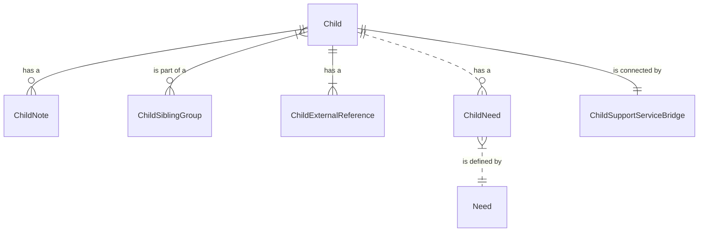
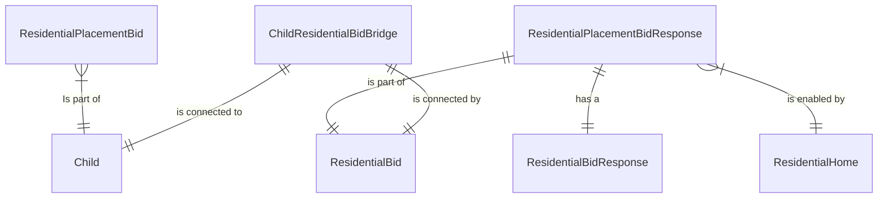
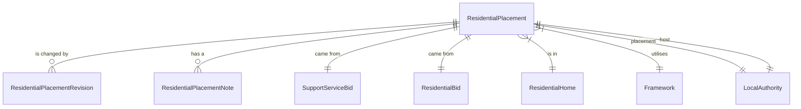
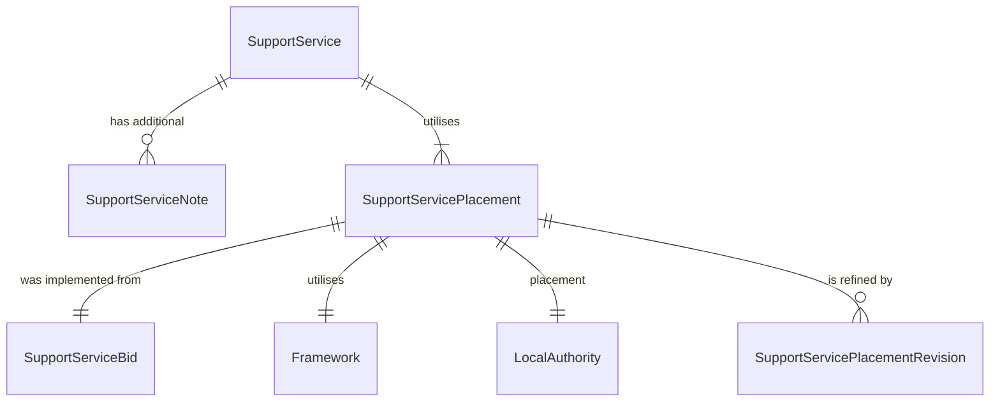
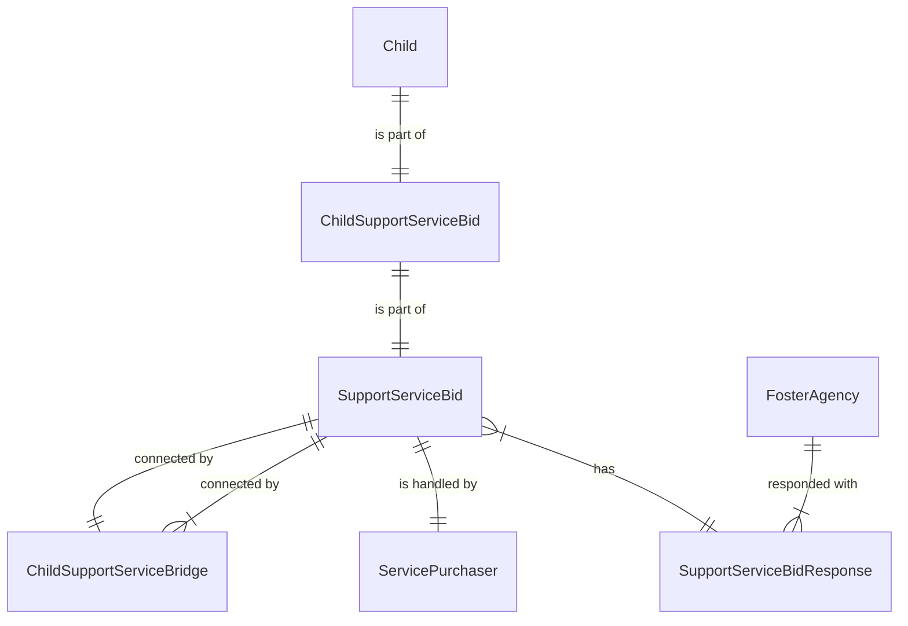
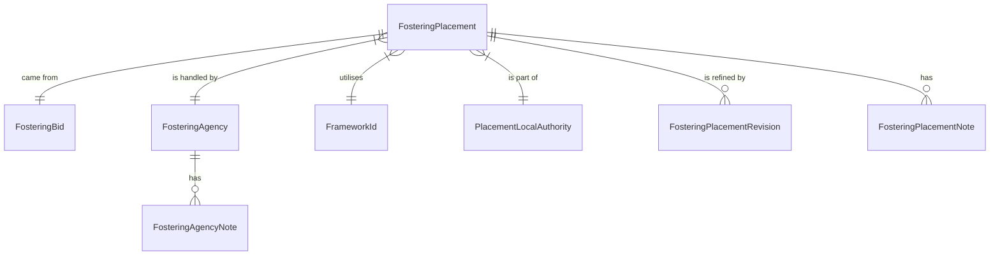
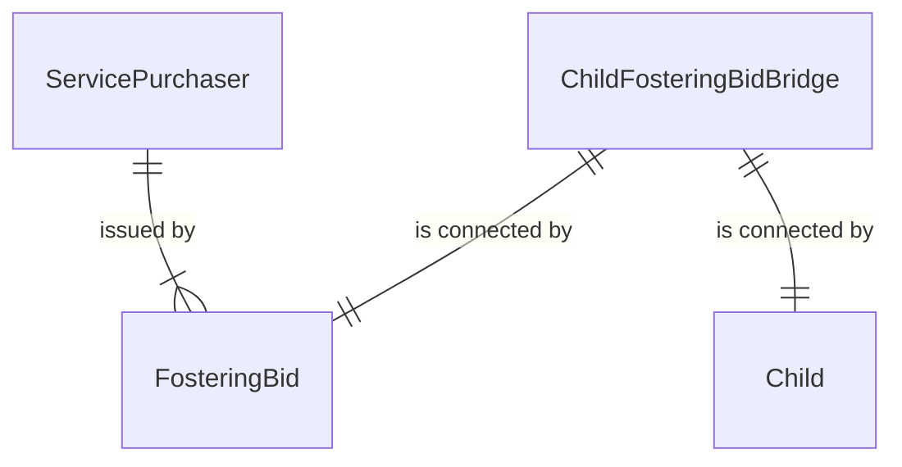
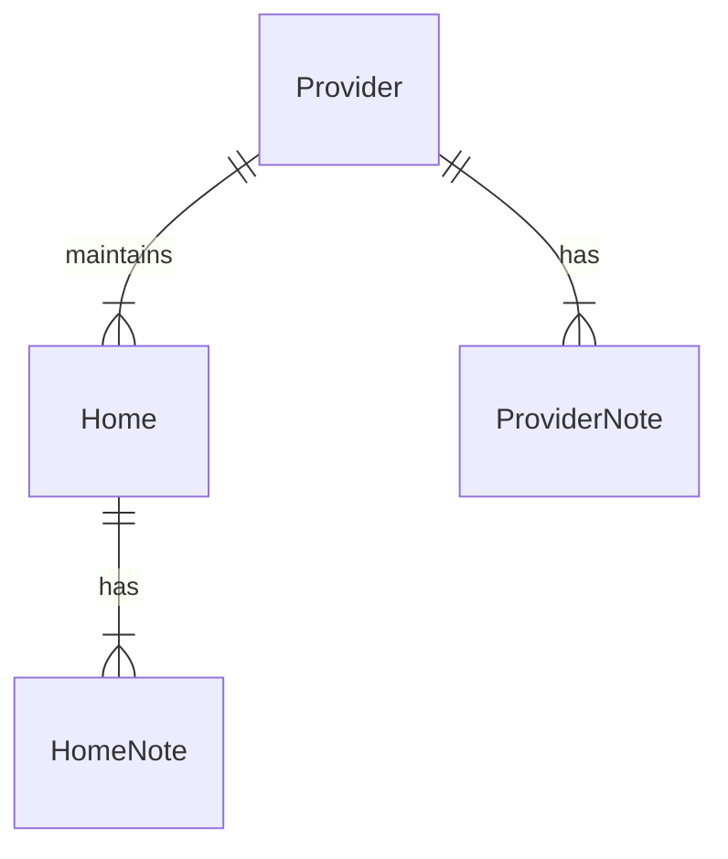

# CPP Data Model
Model to track the bidding and placement process for children in care 

# Current Structure:
Here is an ER Diagram showing the current relationships between the different tables.  
For a breakdown of the different tables, please see the linked [YAML file](data_model.yaml).

Because of the complexity of this model, I've tried to group things into sections.

## Child

## ResidentialBid

## ResidentialPlacement

## Support Service

## Support Service Bid

    
## Fostering Placement

## Fostering Placement Bid

## Provider
