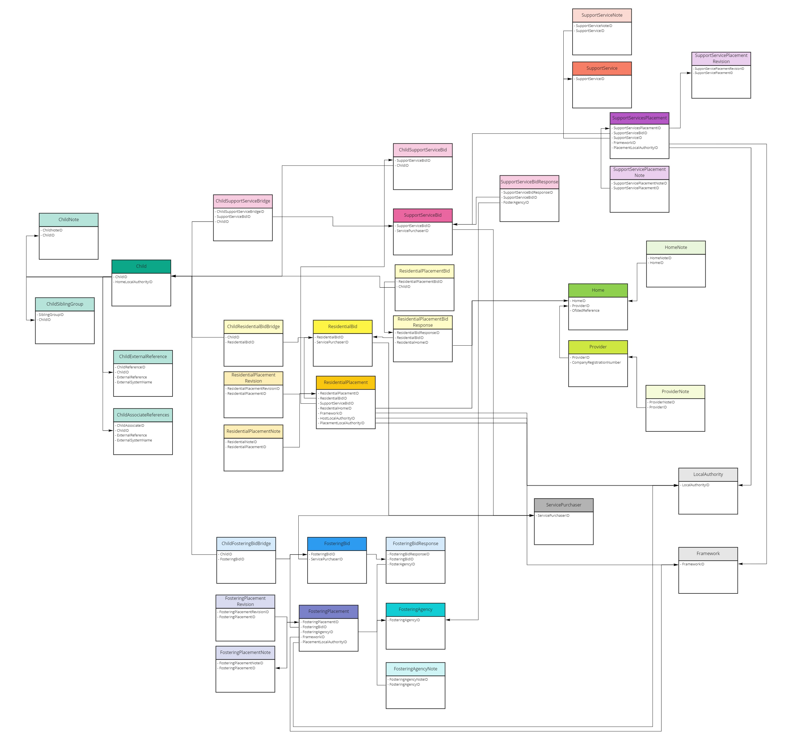

# CPP Data Model
Model to track the bidding and placement process for children in care 

# Current Structure:

Note: There may be some overlap with structures and validation of fields with the LIIA Child Analysis Data Model here: https://github.com/SocialFinanceDigitalLabs/liia-child-analysis/blob/main/wrangling/config/cin_datamap.yaml
