# CPP Data Model
Model to track the bidding and placement process for children in care 

# Current Structure:
Here is an ER Diagram showing the current relationships between the different tables.  
For a breakdown of the different tables, please see the linked [YAML file](data_model.yaml).

```mermaid
erDiagram
    Child ||--o{ ChildNote : has
    Child }|--o{ ChildSiblingGroup : has
    Child ||..|{ ChildExternalReference : has
    Child ||..o{ ChildNeed: has
    ChildNeed }|..|| Need: is
    ChildSupportServiceBridge ||..|| Child: has
    SupportServiceBid ||..|{ ChildSupportServiceBridge : has
    ChildResidentialBidBridge ||..|| ResidentialBid : has
    ChildResidentialBidBridge ||..|| Child : has
    ResidentialPlacement ||..o{ ResidentialPlacementRevision : has 
    ResidentialPlacement ||..o{ ResidentialPlacementNote : has
    ResidentialPlacement ||..|| SupportServiceBid : has
    ResidentialPlacement ||..|| ResidentialBid : has
    ResidentialPlacement }|..|| ResidentialHome : has
    ResidentialPlacement }|..|| Framework : has
    ResidentialPlacement ||..|| LocalAuthority : placement
    ResidentialPlacement ||..|| LocalAuthority : host 
    ResidentialPlacementBidResponse ||..|| ResidentialBidResponse : has
    ResidentialPlacementBidResponse ||..|| ResidentialBid : has
    ResidentialPlacementBidResponse ||..|| ResidentialHome : has
    ResidentialPlacementBid ||..|| Child : has
    SupportServiceBid ||..|| ChildSupportServiceBridge: has
    SupportServiceBid ||..|| ServicePurchaser: has
    ChildSupportServiceBid ||..|| SupportServiceBid: has
    ChildSupportServiceBid ||..|| Child: has
    SupportServiceBidResponse }|..|| SupportServiceBid : has
    SupportServiceBidResponse }|..|| FosterAgency : has
    FosteringPlacement ||..|{ FosteringBid : has
    FosteringPlacement }|..|| FosteringAgency : has
    FosteringPlacement }|..|| FrameworkId : has
    FosteringPlacement }|..|| PlacementLocalAuthority : has
    FosteringPlacement ||..o{ FosteringPlacementRevision : has
    FosteringPlacement ||..o{ FosteringPlacementNote : has
    FosteringBid }|..|| ServicePurchaser : has
    ChildFosteringBidBridge ||..|| Child : has
    ChildFosteringBidBridge ||..|| FosteringBid : has 
    FosteringAgency ||..o{ FosteringAgencyNote : has
    Home }|..|| Provider : has
    Home ||..|{ HomeNote : has
    Provider ||..|{ ProviderNote : has
    SupportService ||..o{ SupportServiceNote : has
    SupportService ||..|{ SupportServicePlacement : has
    SupportServicePlacement ||..|| SupportServiceBid : has
    SupportServicePlacement ||..|| Framework : has
    SupportServicePlacement ||..|| LocalAuthority : placement
    SupportServicePlacement ||..o{ SupportServicePlacementRevision : has
```
